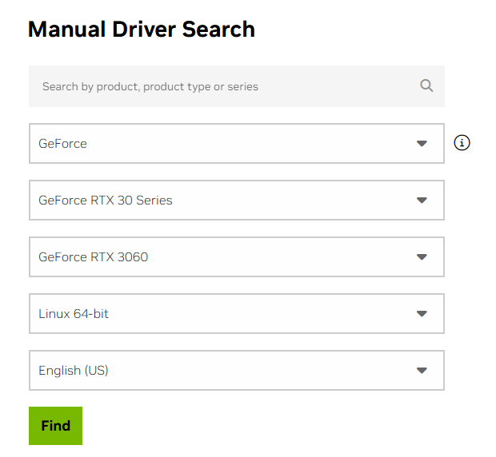
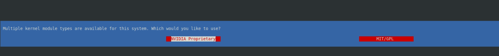
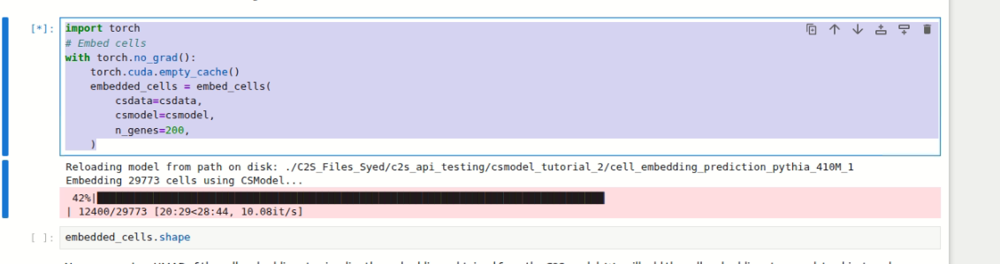

# Tutorial de Instalação do Cell2Sentence

## Introdução

Olá, como estão? email é para falar da instalação do **Cell2Sequence**!

Antes de começar, não recomendo usar o gerenciador de ambiente padrão do Python porque você pode ter mais problemas quando se trata desse assunto, ou seja, para dependênicas de bibiotecas de visão computacional e inteligência artificial. Recomendo que utilize o **CONDA** mesmo, pois ele gerencia melhor os pacotes. Além disso, os pacotes do repositório Git que será instalado já possuem configurações projetadas para ambiente Conda.

Outro ponto que gostaria de destacar é: tenha o driver da NVIDIA instalado. Neste PC, utilizei uma NVIDIA GeForce RTX 3060 com 12GB de VRAM, rodando em Linux (Linux Mint). Não se preocupe com o CUDA, pois ele será instalado automaticamente via PyTorch.

Para verificar se você tem o driver instalado, digite:

```bash
nvidia-smi
```

Se não estiver instalado, baixe do link: https://www.nvidia.com/en-us/drivers/




## Verificação e Instalação do Driver NVIDIA

### Verificar o Driver Atual

Primeiro, verifique se o driver NVIDIA está instalado:

```bash
nvidia-smi
```

Se instalado corretamente, você verá uma saída similar a:

```
Wed Feb 25 17:52:29 2026
+-----------------------------------------------------------------------------------------+
| NVIDIA-SMI 580.126.18             Driver Version: 580.126.18     CUDA Version: 13.0     |
+-----------------------------------------+------------------------+----------------------+
| GPU  Name                 Persistence-M | Bus-Id          Disp.A | Volatile Uncorr. ECC |
| Fan  Temp   Perf          Pwr:Usage/Cap |           Memory-Usage | GPU-Util  Compute M. |
|                                         |                        |               MIG M. |
|=========================================+========================+======================|
|   0  NVIDIA GeForce RTX 3060        Off |   00000000:01:00.0  On |                  N/A |
|  0%   31C    P8             16W /  170W |     126MiB /  12288MiB |      0%      Default |
|                                         |                        |                  N/A |
+-----------------------------------------+------------------------+----------------------+
```

### Baixar e Instalar o Driver (se necessário)

Se o driver não estiver instalado:

1. Acesse: https://www.nvidia.com/en-us/drivers/
2. Selecione sua GPU e sistema operacional
3. Baixe o arquivo de instalação
4. Execute os seguintes comandos:

```bash
cd ~/Downloads
chmod +x NVIDIA-Linux-x86_64-580.126.18.run
sudo ./NVIDIA-Linux-x86_64-580.126.18.run
```




5. Durante a instalação:
   - Selecione a versão **proprietária** do driver
   - Aceite as configurações padrão

---

## Instalação do Miniconda

O Conda é recomendado para gerenciar ambientes Python em projetos de visão computacional e IA, pois:
- Gerencia melhor as dependências complexas
- O cell2sentence foi projetado para ambientes Conda
- Evita conflitos entre versões de pacotes

### Baixar o Miniconda

```bash
wget https://repo.anaconda.com/miniconda/Miniconda3-latest-Linux-x86_64.sh -O miniconda.sh
```

Saída esperada:
```
--2026-02-25 20:08:15--  https://repo.anaconda.com/miniconda/Miniconda3-latest-Linux-x86_64.sh
Resolving repo.anaconda.com (repo.anaconda.com)... 2606:4700::6810:20f1, ...
HTTP request sent, awaiting response... 200 OK
Length: 156772981 (150M) [application/octet-stream]
Saving to: 'miniconda.sh'

miniconda.sh                100%[====================>] 149,51M   101MB/s    in 1,5s

2026-02-25 20:08:17 (101 MB/s) - 'miniconda.sh' saved [156772981/156772981]
```

### Instalar o Miniconda

```bash
bash miniconda.sh -b -u -p ~/miniconda3
```

Saída esperada:
```
PREFIX=/home/pedro/miniconda3
Unpacking bootstrapper...
Unpacking payload...

Installing base environment...

Preparing transaction: ...working... done
Executing transaction: ...working... done
installation finished.
```

### Ativar o Conda

```bash
source ~/miniconda3/bin/activate
```

Após isso, seu prompt deve mostrar `(base)` no início.

---

## Criação do Ambiente Python

### Criar Ambiente com Python 3.8

```bash
conda create -n cell python=3.8
```

Durante a criação:
1. Aceite os Termos de Serviço quando solicitado (digite `a`)
2. Confirme a instalação dos pacotes (digite `y`)

Saída esperada:
```
Do you accept the Terms of Service (ToS) for https://repo.anaconda.com/pkgs/main?
[(a)ccept/(r)eject/(v)iew]: a

## Package Plan ##

  environment location: /home/pedro/miniconda3/envs/cell

  added / updated specs:
    - python=3.8

The following packages will be downloaded:

    package                    |            build
    ---------------------------|-----------------
    openssl-3.0.19             |       h1b28b03_0         4.4 MB
    pip-24.2                   |   py38h06a4308_0         2.2 MB
    python-3.8.20              |       he870216_0        23.8 MB
    setuptools-75.1.0          |   py38h06a4308_0         1.7 MB
    ...
    ------------------------------------------------------------
                                           Total:        33.4 MB

Proceed ([y]/n)? y

Preparing transaction: done
Verifying transaction: done
Executing transaction: done
```

### Ativar o Ambiente

```bash
conda activate cell
```

Seu prompt agora deve mostrar `(cell)` no início.

---

## Instalação do Cell2Sentence

### Criar Diretório de Trabalho

```bash
mkdir /home/pedro/work
cd /home/pedro/work
```

### Clonar o Repositório

```bash
git clone https://github.com/vandijklab/cell2sentence.git
cd cell2sentence
```

Saída esperada:
```
Cloning into 'cell2sentence'...
remote: Enumerating objects: 241, done.
remote: Counting objects: 100% (86/86), done.
remote: Compressing objects: 100% (24/24), done.
remote: Total 241 (delta 65), reused 70 (delta 62), pack-reused 155 (from 1)
Receiving objects: 100% (241/241), 8.58 MiB | 32.92 MiB/s, done.
Resolving deltas: 100% (124/124), done.
```

### Instalar o Cell2Sentence e Dependências

```bash
pip install .
```

Este comando instalará automaticamente:
- PyTorch (com suporte CUDA)
- Transformers (Hugging Face)
- Datasets
- AnnData e Scanpy (análise de single-cell)
- Jupyter Lab
- Outras dependências necessárias

Saída esperada (resumida):
```
Processing /home/pedro/work/cell2sentence
  Installing build dependencies ... done
  Getting requirements to build wheel ... done
  Preparing metadata (pyproject.toml) ... done
Collecting torch (from cell2sentence==1.2.0)
  Downloading torch-2.4.1-cp38-cp38-manylinux1_x86_64.whl.metadata (26 kB)
Collecting transformers (from cell2sentence==1.2.0)
  Downloading transformers-4.46.3-py3-none-any.whl.metadata (44 kB)
...
Successfully built cell2sentence
Installing collected packages: ...
```

**Nota:** A instalação pode demorar alguns minutos dependendo da velocidade da internet.

### Instalar Jupyter Notebook (opcional)

Para executar os tutoriais interativos:

```bash
pip install notebook
```

---

## Cell2Sentence-FT

### Clonar o Repositório Cell2Sentence-FT

No diretório de trabalho, clone o repositório de fine-tuning:

```bash
cd /home/pedro/work
git clone https://github.com/SiYangming/cell2sentence-ft.git
cd cell2sentence-ft
```

Saída esperada:
```
Cloning into 'cell2sentence-ft'...
remote: Enumerating objects: 127, done.
remote: Counting objects: 100% (127/127), done.
remote: Compressing objects: 100% (86/86), done.
remote: Total 127 (delta 45), reused 99 (delta 30), pack-reused 0 (from 0)
Receiving objects: 100% (127/127), 4.48 MiB | 18.41 MiB/s, done.
Resolving deltas: 100% (45/45), done.
```

### Criar Ambiente Conda Específico para Fine-Tuning

O cell2sentence-ft usa Python 3.10 e inclui dependências específicas para treinamento. Crie um ambiente separado usando o arquivo `environment.yml`:

```bash
conda env create -f environment.yml
```

Saída esperada:
```
2 channel Terms of Service accepted
Channels:
 - conda-forge
 - pytorch
 - huggingface
 - nvidia
 - bioconda
 - defaults
Platform: linux-64
Collecting package metadata (repodata.json): done
Solving environment: done

Downloading and Extracting Packages:

Preparing transaction: done
Verifying transaction: done
Executing transaction: done
Installing pip dependencies: - Ran pip subprocess with arguments:
['/home/pedro/miniconda3/envs/c2s/bin/python', '-m', 'pip', 'install', '-U', '-r', ...]

Pip subprocess output:
Collecting gdown (from -r ...)
  Downloading gdown-5.2.1-py3-none-any.whl.metadata (5.8 kB)
...
Successfully installed gdown-5.2.1

done
#
# To activate this environment, use
#
#     $ conda activate c2s
#
# To deactivate an active environment, use
#
#     $ conda deactivate
```

**Observação:** Este processo pode demorar vários minutos, pois instalará:
- PyTorch com CUDA
- Transformers e Datasets (Hugging Face)
- Bibliotecas de bioinformática (scanpy, anndata)
- Ferramentas de treinamento (accelerate, peft)
- Utilitários (gdown para download de dados)

### Ativar o Ambiente de Fine-Tuning

```bash
conda activate c2s
```

Seu prompt agora deve mostrar `(c2s)` no início.

### Desativar o Ambiente

Após o treinamento:

```bash
conda deactivate
```
## Verificação da Instalação

### Testar Importação

Abra o Python e teste:

```bash
python
```

```python
>>> import cell2sentence
>>> import torch
>>> print(f"PyTorch version: {torch.__version__}")
>>> print(f"CUDA available: {torch.cuda.is_available()}")
>>> print(f"CUDA version: {torch.version.cuda}")
>>> quit()
```

Saída esperada:
```
PyTorch version: 2.4.1
CUDA available: True
CUDA version: 12.1
```

---

## Executar os Tutoriais

Existem alguns tutoriais em: `cell2sentence/tutorials/`.

Tive problema executar alguns treinamento mais por exesso de uso de memoria da gpu, afina minha só tem 12GB. Entãp recomendo que use:

```
with torch.no_grad():
    torch.cuda.empty_cache()
```

Principalmente no trecho do arquivo: `c2s_tutorial_2_cell_embedding.ipynb`, substituia dessa forma:
```
import torch
# Embed cells
with torch.no_grad():
    torch.cuda.empty_cache()
    embedded_cells = embed_cells(
        csdata=csdata,
        csmodel=csmodel,
        n_genes=200,
    )
```


### Iniciar Jupyter Notebook

```bash
cd /home/pedro/work/cell2sentence/tutorials/
jupyter notebook
```
## Gerenciamento do Ambiente

### Desativar o Ambiente

Quando terminar de usar o cell2sentence:

```bash
conda deactivate
```

### Reativar o Ambiente

Para usar novamente:

```bash
source ~/miniconda3/bin/activate
conda activate cell
```

### Problema: CUDA não disponível

Verifique:
1. Driver NVIDIA instalado: `nvidia-smi`
2. PyTorch com CUDA: `python -c "import torch; print(torch.cuda.is_available())"`