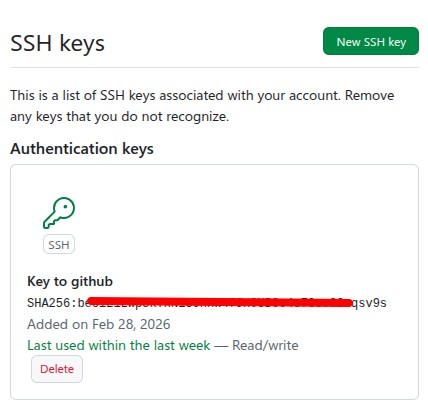

# GitHub - Mode d'emploi


## Setting Up an SSH Key for `git push`

This guide explains how to configure SSH so that work authored by:

```
fake-sophron500ac@gmail.com
```

can be pushed to the repository:

```
https://github.com/FemtoEmacs/cell2sequence_guide/
```

---

Obs. Both the email and the repository don't exist.

### Overview

To push code securely to GitHub without using passwords, you must:

1. Create an SSH key
2. Add the public key to your GitHub account
3. Configure your repository to use SSH instead of HTTPS
4. Push your changes

---

### Step 1 — Create an SSH Key

Open a terminal and run:

```bash
ssh-keygen -t ed25519 -C "fake-sophron500ac@gmail.com"
```

When prompted:

```
Enter file in which to save the key (/home/your-user/.ssh/id_ed25519):
```

Press **Enter** to accept the default location.

You may set a passphrase or press Enter to skip.

This creates:

```
~/.ssh/id_ed25519       (private key — keep secret)
~/.ssh/id_ed25519.pub   (public key — upload to GitHub)
```

---

### Step 2 — Add the SSH Key to GitHub

Display your public key:

```bash
cat ~/.ssh/id_ed25519.pub
```

Copy the entire output.

Then:

1. Go to https://github.com/settings/keys
2. Click **New SSH Key**
3. Give it a title (e.g., "Laptop")
4. Paste the public key
5. Click **Add SSH Key**

Signing to GitHub can be challenging. Therefore,
I recommend to sign once and don't sign out.
Use a browser where you are already signed in
to go to the site below.

[https://github.com/settings/keys]
(https://github.com/settings/keys)


---

### Step 3 — Test SSH Authentication

Run:

```bash
ssh -T git@github.com
```

Expected output:

```
Hi FemtoEmacs! You've successfully authenticated, but GitHub does not provide shell access.
```

This confirms SSH is correctly configured.

---

### Step 4 — Configure the Repository to Use SSH

Your repository URL is currently:

```
https://github.com/FemtoEmacs/cell2sequence_guide/
```

Git push will fail over HTTPS unless you use a token.  
Instead, switch the remote to SSH.

Inside the repository directory, run:

```bash
git remote set-url origin git@github.com:FemtoEmacs/cell2sequence_guide.git
```

Verify:

```bash
git remote -v
```

You should see:

```
git@github.com:FemtoEmacs/cell2sequence_guide.git
```

---

### Step 5 — Push Your Work

Now push:

```bash
git add .
git commit -m "React to cell2sentence."
git push
```

Your changes should upload successfully without requiring a password.

---

## Optional — If SSH Agent Is Needed

If you encounter authentication issues, start the SSH agent:

```bash
eval "$(ssh-agent -s)"
ssh-add ~/.ssh/id_ed25519
```

---

## Done

You can now securely push commits authored by:

```
fake-sophron500ac@gmail.com
```

to:

```
https://github.com/FemtoEmacs/cell2sequence_guide/
```

using SSH authentication.

## git push
Whenever you need to git-push something,
enter the local directory, and follow the
steps bellow.

```bash
~/cell2sequence_guide$ git add .
~/cell2sequence_guide$ git commit -m "React to cell2sentence."
~/cell2sequence_guide$ git push
```
## git pull
Here is how to pull the most recent commits:

```bash
~/cell2sequence_guide$ git add .
```

## Files between 25 MB and 100 MB

Vamos escolher um arquivo no Cellxgene com menos de 100 MB, mas maior que 25 MB. Quanto menos células o arquivo tiver, maiores as chances de ter menos de 100 MB.

[https://cellxgene.cziscience.com/datasets](https://cellxgene.cziscience.com/datasets)

Vamos tentar o arquivo SMBO-106 de 'urinary bladder cancer'.
Depois de fazer o download, renomeie o arquivo
para `bladder.h5ad`. Em seguida, execute o script
`keys.py` para listar as keys de observação disponíveis.

```bash
(cell) ~/c2s-yale/until-100MB$ mv 213298a7-87c6-48ce-a3fe-5b428e57dd68.h5ad bladder.h5ad
(cell) ~/c2s-yale/until-100MB$ ls
bladder.h5ad  keys.py  xact.src
(cell) ~/c2s-yale/until-100MB$ python keys.py bladder.h5ad
Keys:
Index(['donor_id', 'development_stage_ontology_term_id',
       'sex_ontology_term_id', 'self_reported_ethnicity_ontology_term_id',
       'disease_ontology_term_id', 'tissue_type', 'tissue_ontology_term_id',
       'cell_type_ontology_term_id', 'assay_ontology_term_id',
       'suspension_type', 'sample_id', 'HER2_Status', 'rna_ERBB2',
       'consensusClass', 'nCount_RNA', 'nFeature_RNA', 'percent.mt',
       'is_primary_data', 'cell_type', 'assay', 'disease', 'sex', 'tissue',
       'self_reported_ethnicity', 'development_stage', 'observation_joinid'],
      dtype='object')
```

### Upload de um arquivo de 88 MB
Agora, vamos ver como fazer upload de um arquivo maior que 25 MB, porém menor que 100 MB. Eu crio uma pasta chamada 'under100' para colocar o arquivo 'bladder.h5ad'. Então, executo os comandos abaixo.

```bash
~/c2s-yale/cell2sentence_guide/under100$ git add .
~/c2s-yale/cell2sentence_guide/under100$ git commit -m "Add existing file"
~/c2s-yale/cell2sentence_guide/under100$ git branch
* main
~/c2s-yale/cell2sentence_guide/under100$ git push origin main
```

### Criando um branch
Criar um branch para arquivos entre 25 MB e 100 MB pode ser conveniente para o desenvolvedor, mas pode ser confuso para usuários e engenheiros de GitHub. Em todo caso, convém explicar como fazer isso.

```bash
~/c2s-yale/cell2sentence_guide/under100$ git switch -c large-h5ads
Switched to a new branch 'large-h5ads'
~/c2s-yale/cell2sentence_guide/under100$ git branch
* large-h5ads
  main
~/c2s-yale/cell2sentence_guide/under100$ git add .
~/c2s-yale/cell2sentence_guide/under100$ git commit -m "Add large h5ad file"
On branch large-h5ads
nothing to commit, working tree clean
~/c2s-yale/cell2sentence_guide/under100$ git push origin large-h5ads
Total 0 (delta 0), reused 0 (delta 0), pack-reused 0
remote: This repository moved. Please use the new location:
remote:   git@github.com:FemtoEmacs/cell2sentence_guide.git
remote:
remote: Create a pull request for 'large-h5ads' on GitHub by visiting:
remote:      https://github.com/FemtoEmacs/cell2sentence_guide/pull/new/large-h5ads
remote:
To github.com:FemtoEmacs/cell2sequence_guide.git
 * [new branch]      large-h5ads -> large-h5ads
```

Don't forget to switch back to the main branch
after finishing the upload of the large file.
After creating a branch, you can switch
between branches with the command
`git switch main` or `git switch large-h5ads`
as shown below. The asterisk shows which branch
is active.

```bash
~/cell2sequence_guide$ git switch main
~/cell2sequence_guide$ git branch

```


