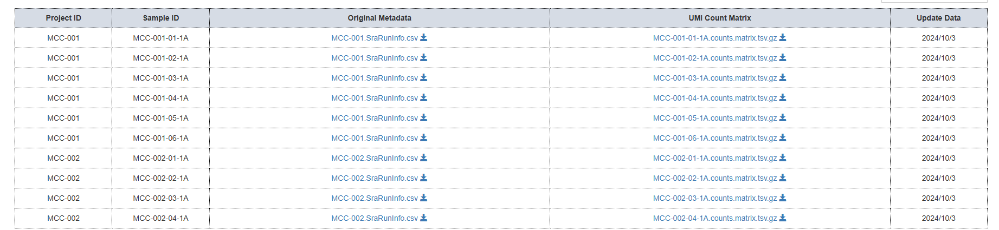

# Conversão de arquivos H5ad 

No cell2sequence  trabalhamos com arquivos no formato h5ad, nesse formato é amplamente usado em bioinformática (scRNA-seq, etc), camando Anndata. Mas nem todos os dataset geneticos possui esse formato. Nesse documento vamos explicar algumas maneira de conversão de arquivos para H5ad, além de explicifar alguns dataset publicos. 


## Lista de Dataset Publicos

 - [NyGEN.io](https://www.nygen.io/resources/blog/public-single-cell-rna-seq-databases)
 - [Ngdc.CNCB](https://ngdc.cncb.ac.cn/cancerscem/)

## Conversão TSV para 

 - Acesse os site [](https://ngdc.cncb.ac.cn/cancerscem/index):
 - Selecione a opção de Download na barra:
 
 
 
  - Selecionar o algum Celltypes:

 

### R converte H5ad

  - Após o download, podemos usar o R para converte o arquivo.
  
  - Instruções para instalar o R [aqui](./r-install/).


## Python converte H5ad

### Conda - Ambiente:

Se você segui a instalação do cell2sequence [aqui](b-instalar) você instalou o miniconda em seu sistema. Então podemos utiliza-la para gerar um ambiente que faz a conversão dos arquivos tsv para H5ad. Então começamos com:


 - Crie o ambiente de conversão.

```
(base) pedro@server-02:/mnt/d/Works/$ conda create -n generate-h5ad
```


 - Ative o ambiente.

```
(base) pedro@server-02:~/wrk/$ conda activate generate-h5ad
```


- Agora instale as seguintes library:

```
(generate-h5ad) pedro@server-02:~/wrk/$ pip install pandas scanpy anndata
```

Como as library instada podemos converte o arquivo em questão com o script [./tsv2h5ad.py](./tsv2h5ad.py).

[[criar o demostração]]